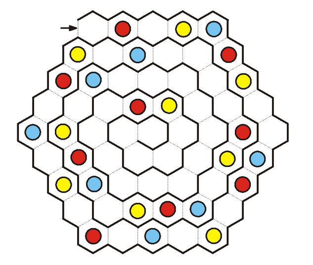

# Hexagon Puzzle Solver

I created this project to help my grandfather with creation of tasks for a logic competition. The task is to fill a hexagon grid of hexagons with colors (or numbers in the case of my program) in the following way:

- Each hexagon either has one color or is empty.
- When traversing the grid in a spiral, the order of colors is always the same and repeating over and over. In other words, if we were to read the numbers in a spiral, there would be a repeating pattern (for example 123123123 would be valid but 123213123 would be invalid).
- Every row and diagonal in the grid contains every color but each of them only once (similar to the rules of Sudoku)

You can see an example of such a grid in the image below. Such image satisfies the first 2 conditions but fails to satisfy the third condition (4th row of the grid doesn't contain blue). We ended up discovering that a grid of such configuration doesn't have a solution.

<p align="center">
  
</p>
## Usage

The program has no external dependencies, only Python3.6 (3.6 due to using the new typing features) or higher is required for running the program. The program requires 2 arguments (numbers), first of which is the grid radius and second is the number of colors (numbers) to try putting in the grid. In order to solve the problem in the image above, run the program as:

```
python3 hexagon.py 4 3
```

You will see that such problem doesn't have a solution. On the other hand, running  the program with a grid of the same size but only 2 numbers would produce 11 solutions, you can see an example of one in the following snippet.

```
> python3 hexagon.py 4 2

    0 0 1 0 2
   0 1 0 2 0 0
  2 0 0 0 0 1 0
 1 0 2 0 0 0 0 0
0 0 0 0 0 0 0 2 1
 2 0 0 0 0 1 0 0
  0 0 1 0 2 0 0
   1 0 0 0 0 2
    0 2 0 1 0
    
... and 10 more solutions
```

## Algorithm for solving the problem

The first problem arises from representing the hexagon grid in memory and making transitions between the cells (unlike with squares, there are 6 directions). I got inspired by [an article by Red Blob Games](https://www.redblobgames.com/grids/hexagons/) and used the following approach:

- Cube coordinates for representing the position. The sum of the 3 coordinates is always 0.
- Represent transitions as a tuple of 6 directions (expressed as deltas in coordinates).
- I implemented a hashing function for the cell class to be able to use the instances as keys of a dictionary (to be able to store the value in the grid)

Now for the algorithm part:

- The main part of the algorithm consists of traversing the hexagonal grid in a spiral using recursion and backtracking. At each cell, the program tries to fill in either a 0 (for empty cell) or the next number (if the numbers to be filled are 12 and the last number was 2, the algorithm would try using 1).
- There is a problem with walking the spiral which has to be taken care of - the spiral is irregular. If we take a look at the initial image, we first have to make 4 steps in right, bottom right, bottom left, left, top left directions but only 3 in top right in the first "level".
- Using backtracking without making any checks along the way would be incredibly slow as the size of the problem grows exponentially. So I am using sets to keep track of content of individual rows and diagonals. This way, after finishing a row (or diagonal), I can check whether the current state is valid (the finished row or diagonal has N unique numbers) in O(1) time. If it isn't valid, there is no point in continuing in the backtracking.